# IT Help Desk Home Lab

## Overview
The workflow follows standard help desk practices including ticket creation, investigation, resolution, and closure.

This project simulates a real-world IT help desk environment using:

- Windows Server 2022 (Active Directory)
- Windows 11 client machine
- Spiceworks Help Desk

This project demonstrates troubleshooting and resolving a user account lockout, including account unlock and password reset procedures using Active Directory.

---

## Ticket: User Unable to Log In (Account Lockout)

### User Report
User reports being unable to log in after multiple failed attempts.  
System displays an account lockout message preventing access.
---

### Step 1: Verify Issue on Client Machine
Confirmed the error message on the login screen.

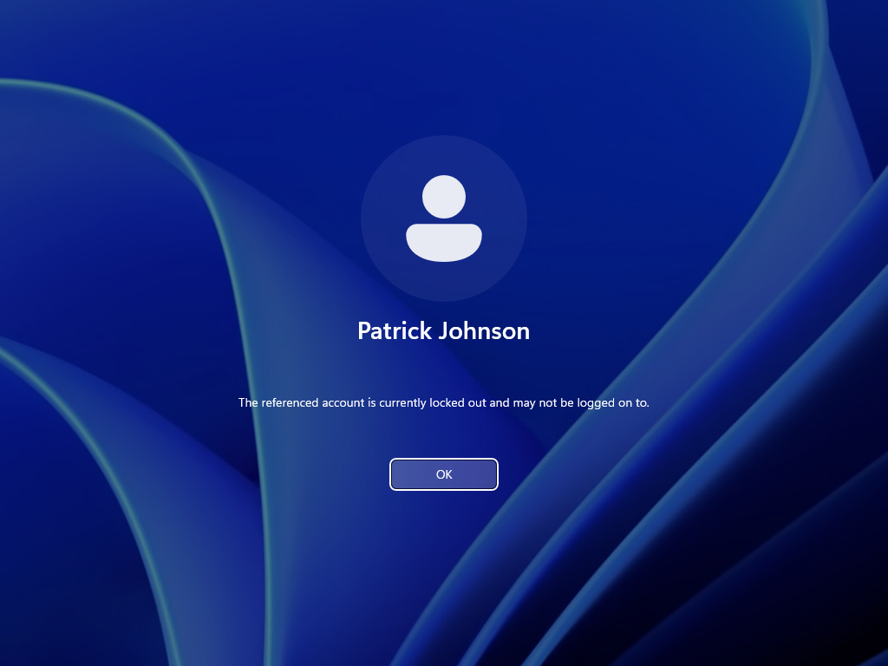

---

### Step 2: Open Active Directory Users and Computers
Accessed Active Directory to locate the user account.

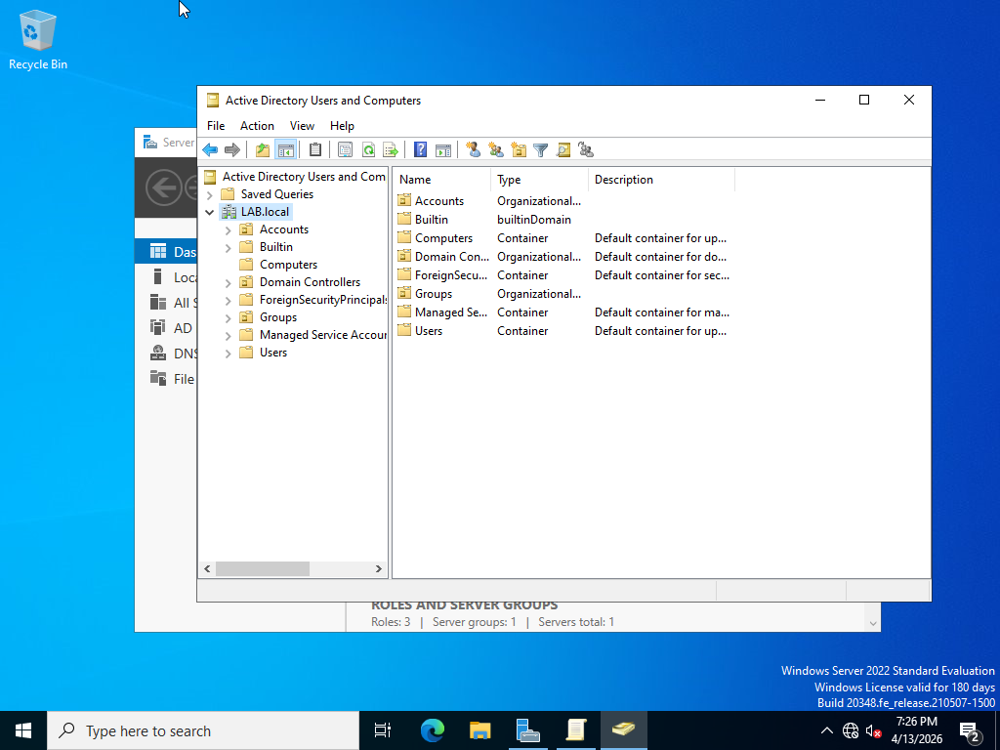

---

### Step 3: Search for User
Used the search function to locate the affected account.

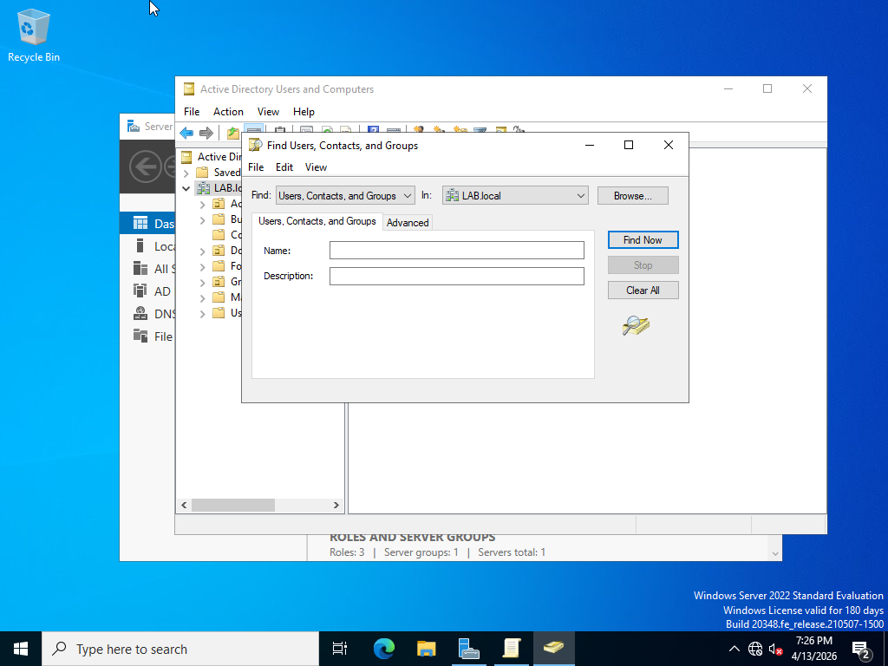

---

### Step 4: Confirm User Account
Verified the correct user account from the search results.

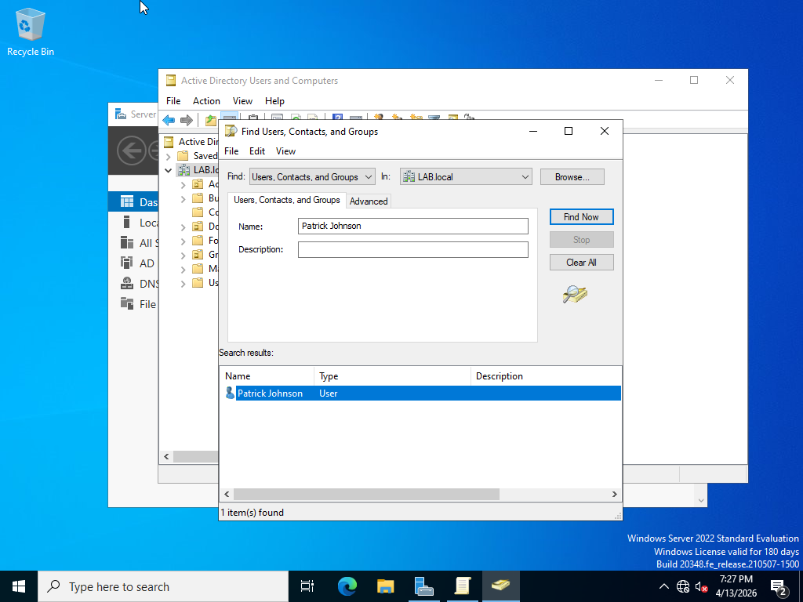

---

### Step 5: Open User Properties and Review Account Status
Opened the user account properties in Active Directory and navigated to the **Account** tab.

Observed that the option **"Unlock account"** was available, and the message indicated the account was currently locked out on the domain controller.

Checked the **"Unlock account"** box to remove the lockout state.

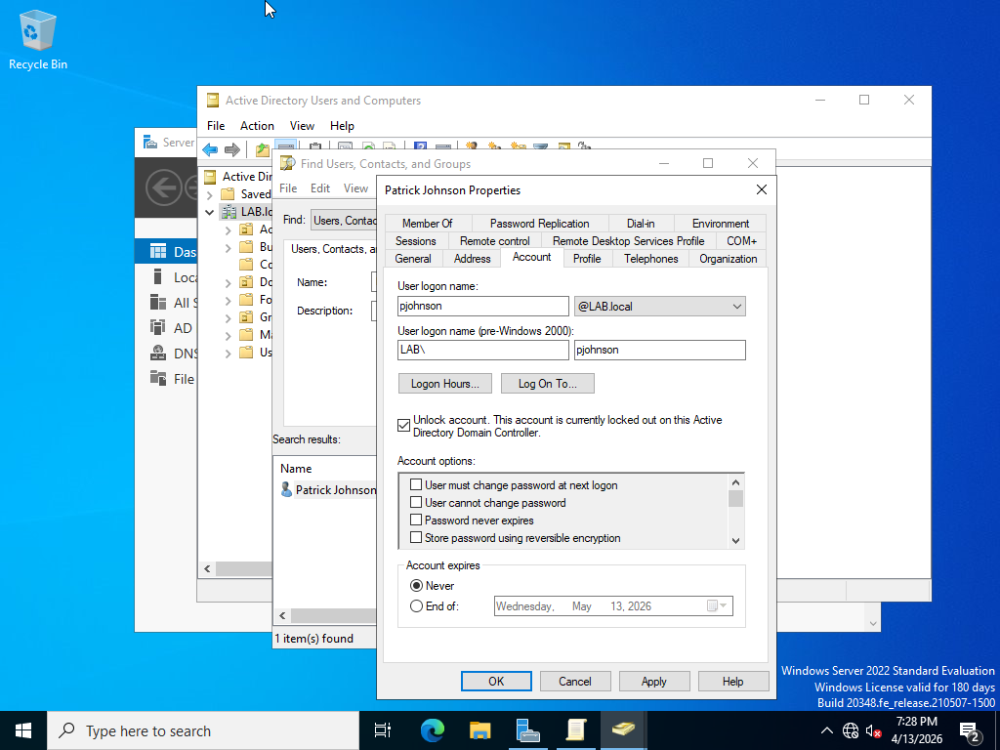

---

### Step 6: Initiate Password Reset
After unlocking the account, initiated a password reset from Active Directory to ensure the user could securely regain access.

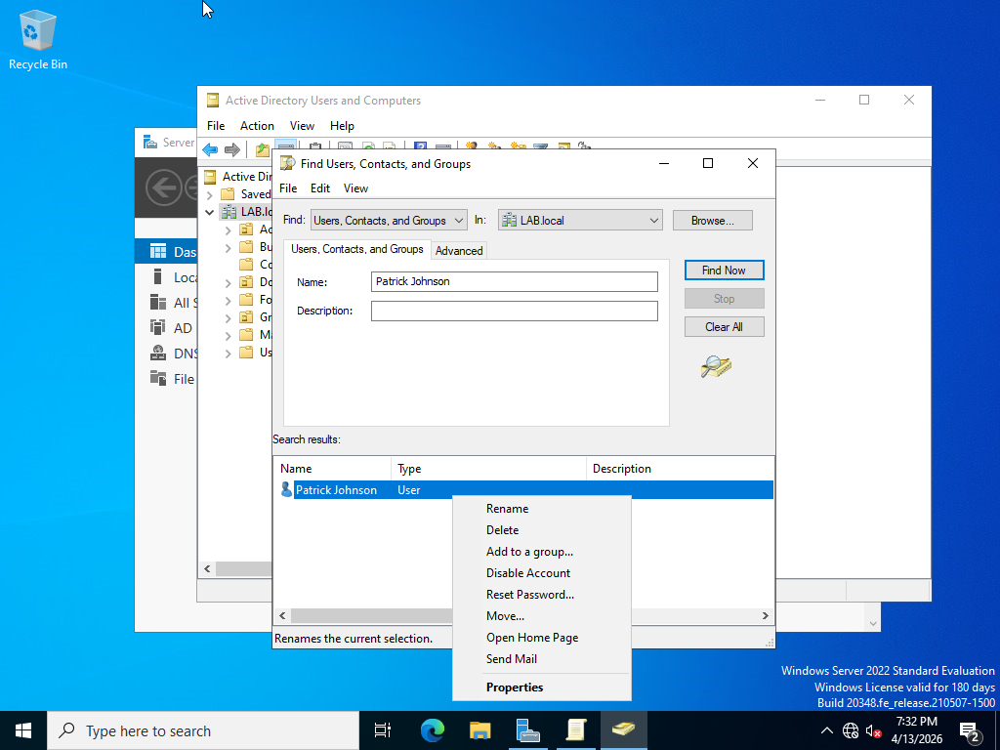

---

### Step 7: Set New Password
Entered and confirmed a new password for the user.

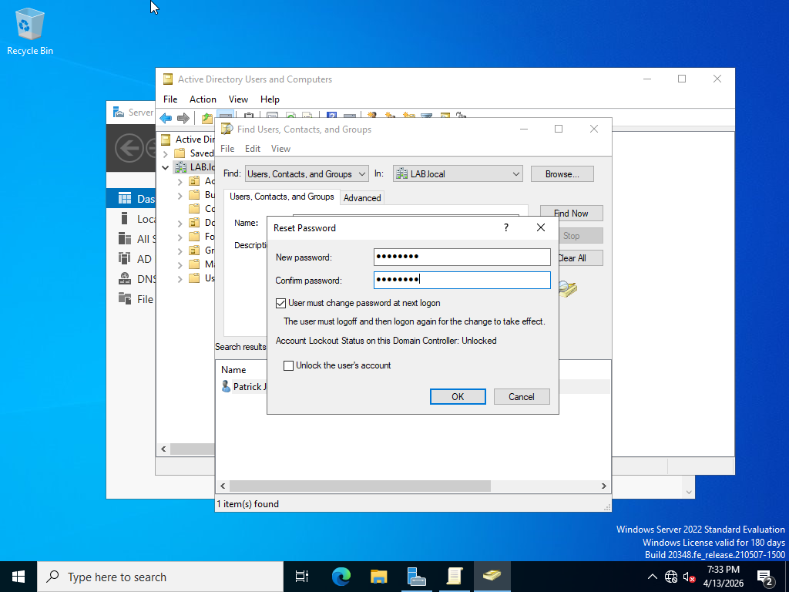

---

### Step 8: Confirm Password Reset
Confirmed password reset was successful, and the account is accessible.

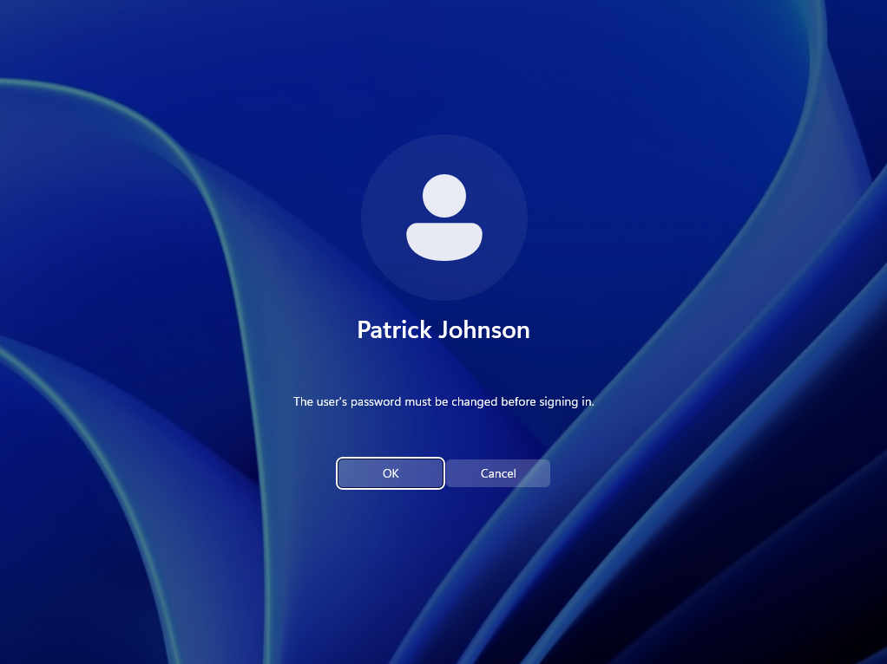

---

### Step 9: User Login Attempt
User attempts to log in with updated credentials.

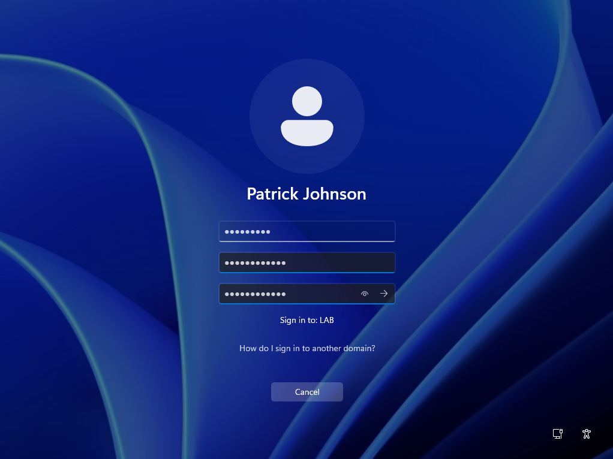

---

### Step 10: Successful Login
User successfully logs in and regains access.

---

### Step 11: Ticket Created
Created a ticket and documented the user issue.

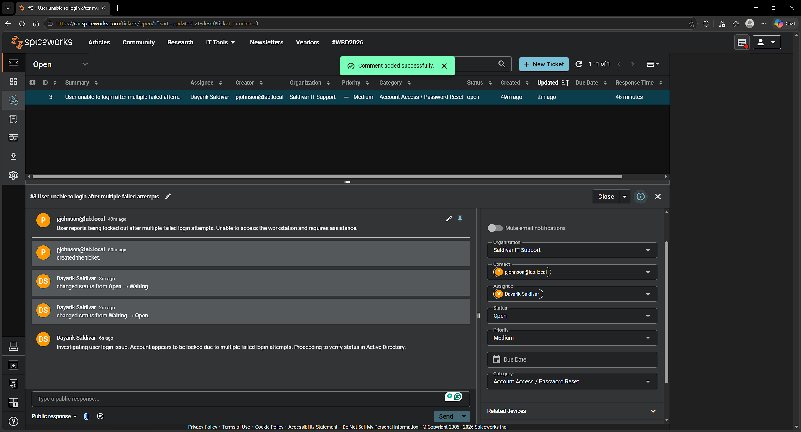

---

### Step 12: Ticket Updated
Documented troubleshooting steps and resolution.

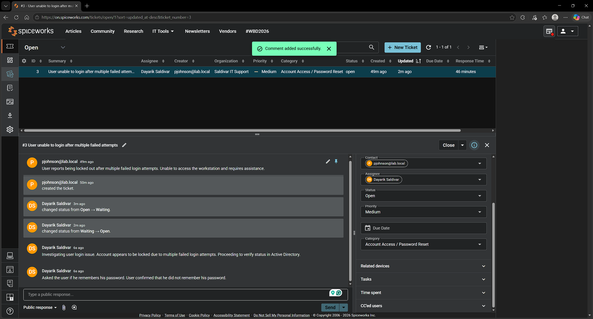

---

### Step 13: Ticket Closed
Confirmed resolution with the user and closed the ticket.

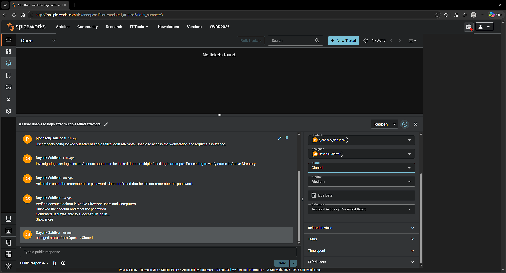

---

## Resolution Summary
User account was locked due to multiple failed login attempts.  
Account was accessed through Active Directory, password was reset, and the user successfully regained access.  
The ticket was updated and closed after confirmation.
